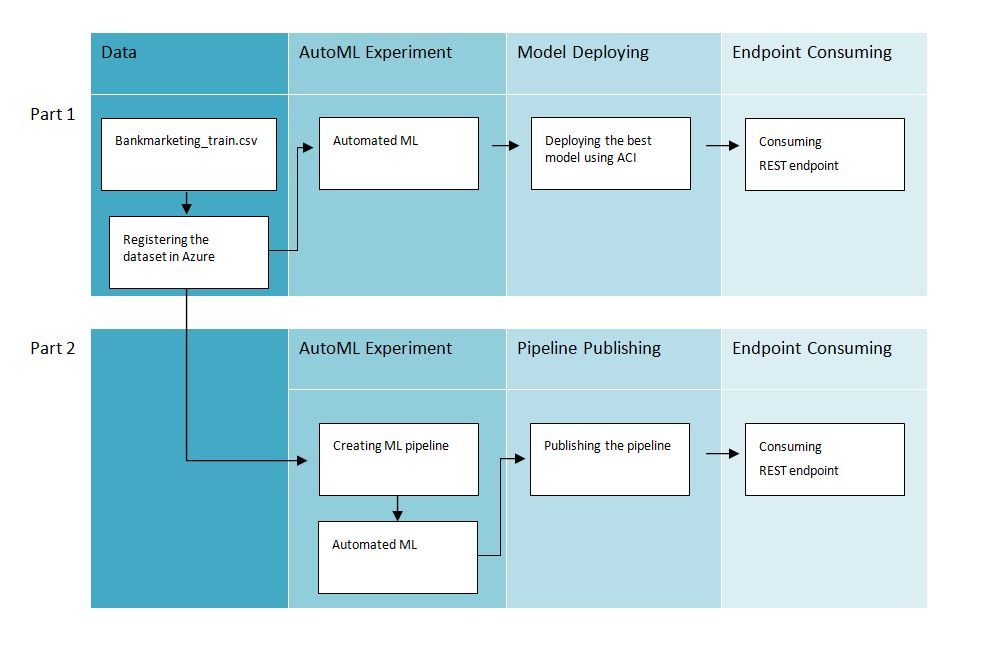
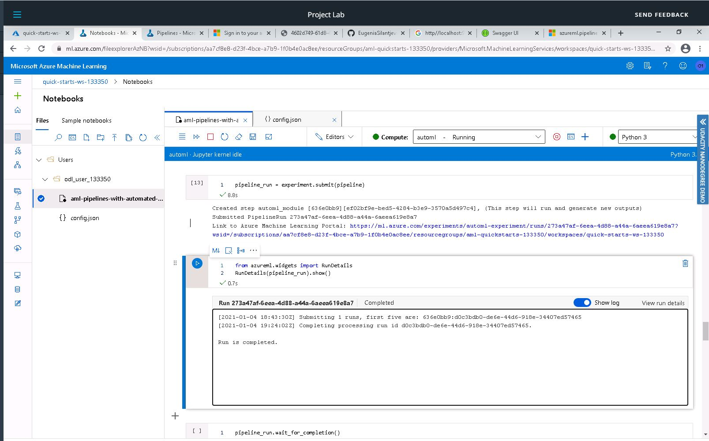

# Operationalising Machine Learning

## Overview
The project consists of two parts. The aim of the first part is to configure, deploy and consume a cloud-based ML production model using Azure. The aim of the second part is to create, publish and consume a pipeline. The Bank Marketing dataset is used to train the models in the first and the second parts. The model (Part 1) and the pipeline (Part 2) will be deployed to their REST endpoints. After the model and the pipeline are deployed, others or other systems can interact with the deployed services by sending HTTP requests to their enspoints. 

## Architectural Diagram

Part 1 Azure ML Studio
1. Registering the dataset to make it available in the Azure workspace for the Automated ML Experiment
2. Using Automated ML to determine the best model
3. Deploying the best model so that it can be consumed
4. Consuming the REST endpoint to interact with the trained model via POST request

Part 2 SDK
1. Using the same dataset registered in Azure workspace for Part 1
2. Creating an ML pipeline with AutoML step and run the experiment
3. Publishing the pipeline so that it can be consumed
4. Consuming the REST endpoint to interact with the pipeline via POST request

## Key Steps

1.	Authentication
2.	Automated ML Experiment
3.	Deploy the best model
4.	Enable Application 
5.	Swagger Documentation
6.	Consume model endpoints
7.	Create and publish a pipeline
8.	Documentation

## Step 1: Authentication 
Authentication is required to ensure uninterrupted flow of operations. I skipped the step since I used the lab udacity provided.

## Step 2: Automated ML Experiment 
The experiment iteratively produces different ML models (various combinations of algorithms and parameters) and determines the best one (the one that is the best fit for the data).

Step 2.1 The Registered Bankmarketing Dataset

Step 2.2 The Completed Experiment

Step 2.3 The Best Model

## Step 3: Deploy the Best Model
This step is important because we published the model so that it can be consumed by others.

## Step 4: Enable Application Insights and Logging 
Once the model is deployed I enabled Application Insights and retireved logs. Application Insightsis is an Azure service that provides key performance information about the deployed service.

Step 4.1 Running the logs.py Script

Step 4.2 Enabled Applications Insights

## Step 5: Swagger Documentation
Swagger makes documentation easier by describing the API, what requests it accepts, inputs and endpoints  

Step 5.1 Swagger Running on Localhost

Step 5.2 Swagger - HTTP API Methods and Responses

Step 5.3 Swagger - HTTP API Methods and Responses (cont'd)

Step 5.4 Swagger - HTTP API Methods and Responses (cont'd)

## Step 6: Consume Model Endpoints
We consume the REST endpoint to interact with the trained model via POST request

Step 6.1 endpoint.py Producing JSON Output

## Step 7: Create and Publish a Pipeline
In this step, I creating an ML pipeline with AutoML step, run the experiment, published the pipeline and consumed the REST endpoint to interact with the pipeline via POST request. Once the pipeline is published, others can consume the REST endpoint to rerun the pipeline from any HTTP library on any platform.

Step 7.1 A Pipline is Created

Step 7.2 A Published Pipeline under the Pipeline Endpoint Tab

Step 7.3 The Bankmarketing Dataset with the AutoML Module

Step 7.4 The Published Pipeline Overview Including Active Satatus and REST Endpoint 

Step 7.5 RunDetails Widget Showing Step Runs 

Step 7.6 Scheduled and Running Pipeline 

## Step 8: Documentation 
I created a screencast showing the entire process of the working ML application and produced a README file documenting the main steps of the project to easily share the project with others.

## Future Works
To achieve a better predictive ability of a model, several improvements can be done. First of all, we need to deal with the class imbalance that we detected during the model training. We can experiment with other metrics suitable for that problem, for instance, F1 score or introduce resampling techniques (oversampling or undersampling). Second, we can manage models used during the Automated ML Experiment and allow only the ones we think will be effective. Third, we can perform k-fold cross validation so that a model gets a better generalisation ability. Finally, feature selection and feature engineering can, too, improve the performance. 

## Screencas on Youtube
https://youtu.be/71SDksY-YX8
